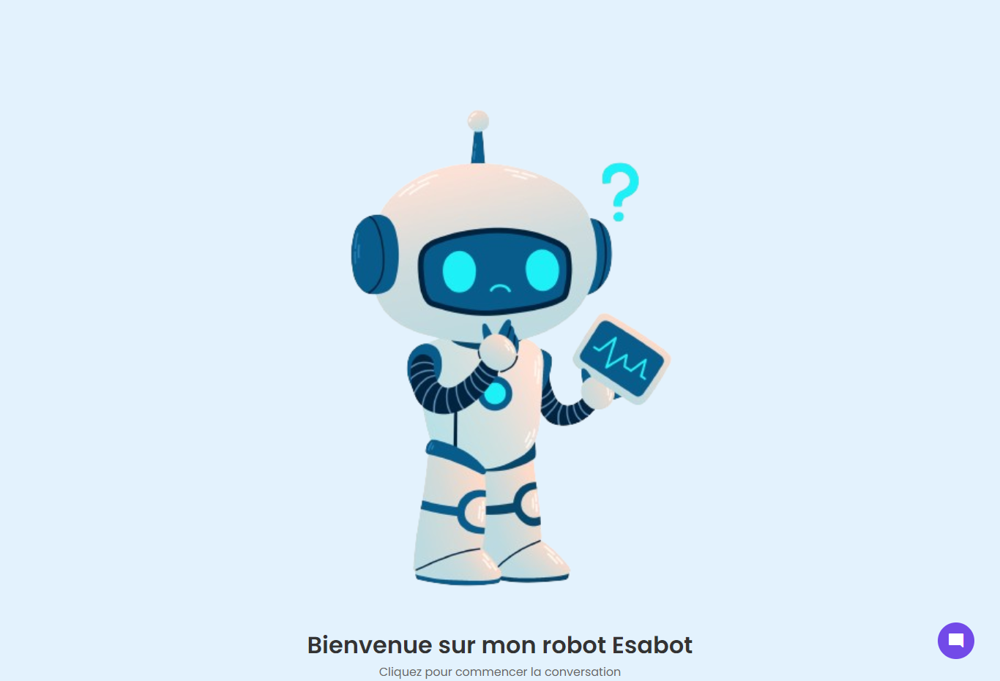
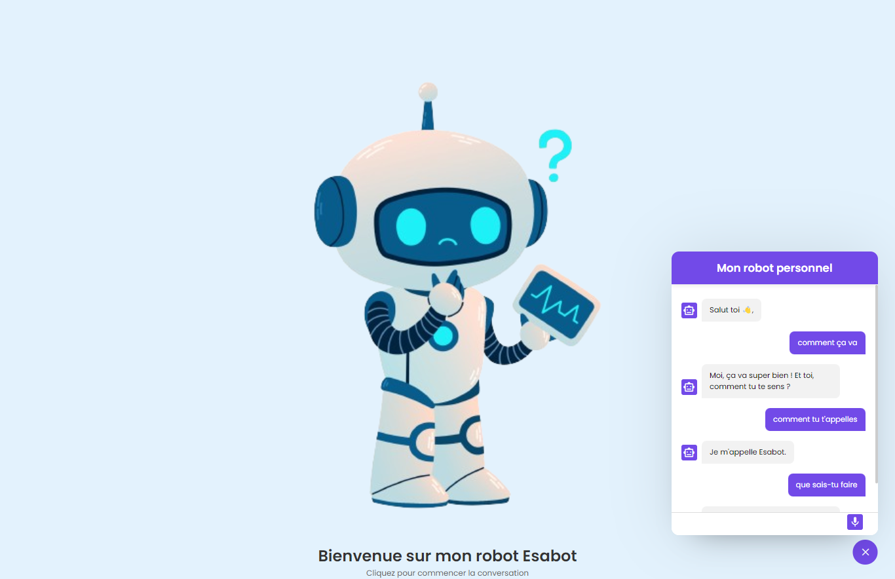

--- French ---

### Projet : Esabot Chatbot | Esacode

**Description :**  
Ce projet consiste en une application web de chatbot interactive, conçue pour offrir une interface conviviale pour interagir avec un chatbot. Il comprend une page web (index.html), un script JavaScript (script.js), et une feuille de style (style.css).

**Fichiers :**
1. index.html - La structure principale de la page web du chatbot.
2. script.js - Le script JavaScript responsable de la gestion des interactions avec le chatbot, notamment l'envoi et la réception de messages.
3. style.css - La feuille de style CSS définissant le style et la mise en page de la page web.
4. bot.png - Une image utilisée dans l'interface du chatbot.

**Caractéristiques Principales :**
- Interface de chatbot interactive.
- Fonctionnalités de réponse automatique basées sur un dictionnaire de phrases pré-définies.
- Conception responsive adaptée à divers appareils.

**Comment Utiliser :**
1. Ouvrez index.html dans un navigateur pour lancer l'application.
2. Utilisez l'interface pour interagir avec le chatbot.

**Captures d'écran :**

*Capture d'écran de l'interface de chatbot en action.*

*Capture d'écran de l'interaction avec le chatbot.*

**Dépendances Externes :**
- Utilisation de Google Fonts pour les icônes et les polices.
- **Note importante :** Pour obtenir des réponses de Chat GPT, assurez-vous de configurer la clé d'API Chat GPT dans le fichier script.js.

**Note de Sécurité :**
Le fichier script.js contient une clé API. Assurez-vous de protéger cette clé dans un environnement de production.

**Démo :**
- Voir la démo : https://projets.expeditalagbe.com/chatbot/

**Code Source sur GitHub :**
- Référentiel GitHub : https://github.com/esaCodeBJ/chatbot

--- English ---

### Project: Esabot Chatbot | Esacode

**Description:**  
This project is a web-based interactive chatbot application, designed to provide a user-friendly interface for interacting with a chatbot. It includes a web page (index.html), a JavaScript script (script.js), and a stylesheet (style.css).

**Files:**
1. index.html - The main structure of the chatbot's web page.
2. script.js - The JavaScript script responsible for managing interactions with the chatbot, including sending and receiving messages.
3. style.css - The CSS stylesheet defining the style and layout of the web page.
4. bot.png - An image used in the chatbot's interface.

**Key Features:**
- Interactive chatbot interface.
- Automated response features based on a predefined dictionary of phrases.
- Responsive design suitable for various devices.

**How to Use:**
1. Open index.html in a browser to launch the application.
2. Use the interface to interact with the chatbot.

**Screenshots:**

*Screenshot of the chatbot interface in action.*

*Screenshot of interaction with the chatbot.*

**External Dependencies:**
- Use of Google Fonts for icons and fonts.
- **Important Note:** To obtain responses from Chat GPT, make sure to configure the Chat GPT API key in the script.js file.

**Security Note:**
The script.js file contains an API key. Ensure that this key is protected in a production environment.

**Demo:**
- View the demo: https://projets.expeditalagbe.com/chatbot/

**Source Code on GitHub:**
- GitHub Repository: https://github.com/esaCodeBJ/chatbot
